# SSTCP 维保系统 - 数据库表关系结构图

> 生成时间: 2026-02-19
> 数据库类型: PostgreSQL
> 数据库名称: tq

---

## 一、核心表关系结构图 (Mermaid)

```mermaid
erDiagram
    %% ==================== 核心表 ====================
    project_info {
        BIGINT id PK "主键ID"
        VARCHAR project_id UK "项目编号(唯一)"
        VARCHAR project_name "项目名称"
        DATETIME completion_date "开始日期"
        DATETIME maintenance_end_date "结束日期"
        VARCHAR maintenance_period "维保频率"
        VARCHAR client_name "客户单位名称"
        VARCHAR address "客户地址"
        VARCHAR project_manager "运维人员"
    }

    %% ==================== 计划管理 ====================
    maintenance_plan {
        BIGINT id PK "主键ID"
        VARCHAR plan_id UK "计划编号(唯一)"
        VARCHAR plan_name "计划名称"
        VARCHAR project_id FK "项目编号"
        VARCHAR plan_type "工单类型"
        VARCHAR equipment_name "设备名称"
        DATETIME plan_start_date "计划开始日期"
        DATETIME plan_end_date "计划结束日期"
        DATETIME execution_date "执行日期"
        VARCHAR responsible_person "负责人"
        VARCHAR plan_status "计划状态"
        VARCHAR execution_status "执行状态"
    }

    work_plan {
        BIGINT id PK "主键ID"
        VARCHAR plan_id UK "计划编号(唯一)"
        VARCHAR plan_type "工单类型"
        VARCHAR project_id FK "项目编号"
        VARCHAR project_name "项目名称"
        DATETIME plan_start_date "计划开始日期"
        DATETIME plan_end_date "计划结束日期"
        VARCHAR status "状态"
    }

    %% ==================== 工单管理 ====================
    periodic_inspection {
        BIGINT id PK "主键ID"
        VARCHAR inspection_id UK "工单编号(唯一)"
        VARCHAR plan_id FK "维保计划编号"
        VARCHAR project_id FK "项目编号"
        VARCHAR project_name "项目名称"
        DATETIME plan_start_date "计划开始日期"
        DATETIME plan_end_date "计划结束日期"
        VARCHAR maintenance_personnel "运维人员"
        VARCHAR status "状态"
        TEXT signature "用户签名"
    }

    periodic_inspection_record {
        BIGINT id PK "主键ID"
        VARCHAR inspection_id FK "巡检单编号"
        VARCHAR item_id "巡检项ID"
        VARCHAR item_name "巡检项名称"
        TEXT inspection_content "巡查内容"
        BOOLEAN inspected "是否已处理"
        TEXT photos "照片URL列表"
        TEXT inspection_result "巡检结果"
    }

    temporary_repair {
        BIGINT id PK "主键ID"
        VARCHAR repair_id UK "维修单编号(唯一)"
        VARCHAR plan_id FK "维保计划编号"
        VARCHAR project_id FK "项目编号"
        VARCHAR project_name "项目名称"
        VARCHAR maintenance_personnel "运维人员"
        VARCHAR status "状态"
        TEXT fault_description "故障描述"
        TEXT solution "解决方案"
        TEXT signature "用户签字"
    }

    spot_work {
        BIGINT id PK "主键ID"
        VARCHAR work_id UK "用工单编号(唯一)"
        VARCHAR plan_id FK "维保计划编号"
        VARCHAR project_id FK "项目编号"
        VARCHAR project_name "项目名称"
        VARCHAR maintenance_personnel "运维人员"
        VARCHAR status "状态"
    }

    %% ==================== 日志管理 ====================
    maintenance_log {
        BIGINT id PK "主键ID"
        VARCHAR log_id UK "日志编号(唯一)"
        VARCHAR project_id FK "项目编号"
        VARCHAR log_type "日志类型"
        DATETIME log_date "日志日期"
        TEXT work_content "工作内容"
        BIGINT is_deleted "是否删除"
    }

    %% ==================== 基础数据 ====================
    customer {
        INTEGER id PK "主键ID"
        VARCHAR name "客户单位"
        VARCHAR address "客户地址"
        VARCHAR contact_person "客户联系人"
        VARCHAR phone "客户联系方式"
    }

    personnel {
        BIGINT id PK "主键ID"
        VARCHAR name "姓名"
        VARCHAR gender "性别"
        VARCHAR phone "联系电话"
        VARCHAR department "所属部门"
        VARCHAR role "角色"
    }

    inspection_item {
        INTEGER id PK "主键ID"
        VARCHAR item_code UK "事项编码(唯一)"
        VARCHAR item_name "事项名称"
        VARCHAR item_type "事项类型"
        INTEGER level "层级"
        INTEGER parent_id FK "父节点ID"
        TEXT check_content "检查内容"
        TEXT check_standard "检查标准"
    }

    dictionary {
        BIGINT id PK "主键ID"
        VARCHAR dict_type "字典类型"
        VARCHAR dict_key "字典键"
        VARCHAR dict_value "字典值"
        VARCHAR dict_label "字典标签"
        BOOLEAN is_active "是否启用"
    }

    %% ==================== 物资管理 ====================
    spare_parts_stock {
        BIGINT id PK "主键ID"
        VARCHAR product_name "产品名称"
        VARCHAR brand "品牌"
        VARCHAR model "产品型号"
        VARCHAR unit "单位"
        INTEGER quantity "库存数量"
        VARCHAR status "状态"
    }

    spare_parts_inbound {
        BIGINT id PK "主键ID"
        VARCHAR inbound_no UK "入库单号(唯一)"
        VARCHAR product_name "产品名称"
        VARCHAR brand "品牌"
        VARCHAR model "产品型号"
        INTEGER quantity "入库数量"
        VARCHAR supplier "供应商"
        VARCHAR user_name "入库人"
    }

    spare_parts_usage {
        BIGINT id PK "主键ID"
        VARCHAR product_name "产品名称"
        VARCHAR brand "品牌"
        VARCHAR model "产品型号"
        INTEGER quantity "领用数量"
        VARCHAR user_name "运维人员"
        DATETIME issue_time "领用时间"
        VARCHAR project_id FK "项目编号"
        BIGINT stock_id FK "库存记录ID"
        VARCHAR status "状态"
    }

    repair_tools_stock {
        BIGINT id PK "主键ID"
        VARCHAR tool_id "工具编号"
        VARCHAR tool_name "工具名称"
        VARCHAR category "工具分类"
        VARCHAR specification "规格型号"
        INTEGER stock "库存数量"
        VARCHAR status "状态"
    }

    repair_tools_issue {
        BIGINT id PK "主键ID"
        VARCHAR tool_id "工具编号"
        VARCHAR tool_name "工具名称"
        VARCHAR specification "规格型号"
        INTEGER quantity "领用数量"
        VARCHAR user_name "运维人员姓名"
        DATETIME issue_time "领用时间"
        DATETIME return_time "归还时间"
        VARCHAR project_id FK "项目编号"
        BIGINT stock_id FK "库存记录ID"
        VARCHAR status "状态"
    }

    %% ==================== 系统配置 ====================
    user_dashboard_config {
        BIGINT id PK "主键ID"
        VARCHAR user_id "用户ID"
        VARCHAR dashboard_type "仪表板类型"
        JSON config "配置数据"
    }

    %% ==================== 关系定义 ====================
    
    %% 项目 -> 各类工单/计划 (1:N CASCADE)
    project_info ||--o{ maintenance_plan : "关联(CASCADE)"
    project_info ||--o{ work_plan : "关联(CASCADE)"
    project_info ||--o{ periodic_inspection : "关联(CASCADE)"
    project_info ||--o{ temporary_repair : "关联(CASCADE)"
    project_info ||--o{ spot_work : "关联(CASCADE)"
    project_info ||--o{ maintenance_log : "关联(CASCADE)"
    
    %% 维保计划 -> 工单 (1:N CASCADE)
    maintenance_plan ||--o{ periodic_inspection : "生成(CASCADE)"
    maintenance_plan ||--o{ temporary_repair : "生成(CASCADE)"
    maintenance_plan ||--o{ spot_work : "生成(CASCADE)"
    
    %% 巡检单 -> 巡检记录 (1:N CASCADE)
    periodic_inspection ||--o{ periodic_inspection_record : "明细(CASCADE)"
    
    %% 巡检事项自关联
    inspection_item ||--o{ inspection_item : "父子关系"
    
    %% 库存与出入库关系
    spare_parts_stock ||--o{ spare_parts_usage : "领用"
    spare_parts_stock ||--o{ spare_parts_inbound : "入库"
    repair_tools_stock ||--o{ repair_tools_issue : "领用"
    
    %% 项目与物资领用
    project_info ||--o{ spare_parts_usage : "关联"
    project_info ||--o{ repair_tools_issue : "关联"
```



---

## 二、表关系层级图

```
┌─────────────────────────────────────────────────────────────────────────────────────┐
│                              第一层：核心主表                                          │
├─────────────────────────────────────────────────────────────────────────────────────┤
│                                                                                     │
│                              ┌──────────────────────┐                               │
│                              │    project_info      │                               │
│                              │    (项目信息表)       │                               │
│                              │    ⭐ 核心表          │                               │
│                              │    记录数: 5         │                               │
│                              └──────────┬───────────┘                               │
│                                         │                                           │
│                                         │ 1:N (CASCADE DELETE)                      │
│                                         │                                           │
└─────────────────────────────────────────┼───────────────────────────────────────────┘
                                          │
          ┌───────────────────────────────┼───────────────────────────────┐
          │                               │                               │
          ▼                               ▼                               ▼
┌─────────────────────┐     ┌─────────────────────┐     ┌─────────────────────┐
│  maintenance_plan   │     │     work_plan       │     │   maintenance_log   │
│   (维保计划表)       │     │   (工作计划表)       │     │   (维保日志表)       │
│   ⭐ 核心表          │     │                     │     │                     │
│   记录数: 151       │     │   记录数: 4         │     │   记录数: 1         │
└──────────┬──────────┘     └─────────────────────┘     └─────────────────────┘
           │
           │ 1:N (CASCADE DELETE)
           │
┌──────────┴──────────────────────────────────────────────────────────────────────────┐
│                              第三层：工单表                                           │
├──────────────────────────────────────────────────────────────────────────────────────┤
│                                                                                      │
│  ┌─────────────────────┐  ┌─────────────────────┐  ┌─────────────────────┐          │
│  │ periodic_inspection │  │  temporary_repair   │  │     spot_work       │          │
│  │   (定期巡检单表)     │  │   (临时维修单表)     │  │   (零星用工单表)     │          │
│  │   记录数: 151       │  │   记录数: 1         │  │   记录数: 0         │          │
│  │   前缀: XJ          │  │   前缀: WX          │  │   前缀: YG          │          │
│  └──────────┬──────────┘  └─────────────────────┘  └─────────────────────┘          │
│             │                                                                        │
│             │ 1:N (CASCADE DELETE)                                                   │
│             │                                                                        │
│             ▼                                                                        │
│  ┌───────────────────────────────┐                                                  │
│  │ periodic_inspection_record    │                                                  │
│  │   (定期巡检记录表)             │                                                  │
│  │   记录数: 8                   │                                                  │
│  └───────────────────────────────┘                                                  │
│                                                                                      │
└──────────────────────────────────────────────────────────────────────────────────────┘

┌──────────────────────────────────────────────────────────────────────────────────────┐
│                              基础数据表 (独立)                                        │
├──────────────────────────────────────────────────────────────────────────────────────┤
│                                                                                      │
│  ┌─────────────────┐  ┌─────────────────┐  ┌─────────────────┐  ┌─────────────────┐ │
│  │    customer     │  │    personnel    │  │ inspection_item │  │   dictionary    │ │
│  │  (客户信息表)    │  │  (人员信息表)    │  │  (巡检事项表)    │  │   (字典表)      │ │
│  │  记录数: 6      │  │  记录数: 8      │  │  记录数: 30     │  │  记录数: 34     │ │
│  └─────────────────┘  └─────────────────┘  └────────┬────────┘  └─────────────────┘ │
│                                                     │                               │
│                                                     │ 自关联 (parent_id)            │
│                                                     ▼                               │
│                                              ┌─────────────────┐                   │
│                                              │ inspection_item │                   │
│                                              │   (子节点)       │                   │
│                                              └─────────────────┘                   │
│                                                                                      │
└──────────────────────────────────────────────────────────────────────────────────────┘

┌──────────────────────────────────────────────────────────────────────────────────────┐
│                              物资管理表                                               │
├──────────────────────────────────────────────────────────────────────────────────────┤
│                                                                                      │
│  ┌─────────────────────────┐              ┌─────────────────────────┐              │
│  │   spare_parts_stock     │              │   repair_tools_stock    │              │
│  │   (备品备件库存表)       │              │   (维修工具库存表)       │              │
│  │   记录数: 101           │              │   记录数: 102           │              │
│  └───────────┬─────────────┘              └───────────┬─────────────┘              │
│              │                                        │                              │
│     ┌────────┴────────┐                      ┌────────┴────────┐                    │
│     │                 │                      │                 │                    │
│     ▼                 ▼                      ▼                 │                    │
│  ┌─────────────┐  ┌─────────────┐       ┌─────────────┐        │                    │
│  │spare_parts  │  │spare_parts  │       │repair_tools │        │                    │
│  │  _inbound   │  │  _usage     │       │  _issue     │        │                    │
│  │(备件入库表)  │  │(备件领用表)  │       │(工具领用表)  │        │                    │
│  │记录数: 101  │  │记录数: 70   │       │记录数: 139  │        │                    │
│  └─────────────┘  └─────────────┘       └─────────────┘        │                    │
│                                                                                      │
└──────────────────────────────────────────────────────────────────────────────────────┘
```

---

## 三、外键关系详细说明

### 3.1 级联删除关系 (CASCADE DELETE)

| 父表 | 子表 | 外键字段 | 删除行为 |
|------|------|----------|----------|
| project_info | maintenance_plan | project_id | 级联删除 |
| project_info | work_plan | project_id | 级联删除 |
| project_info | periodic_inspection | project_id | 级联删除 |
| project_info | temporary_repair | project_id | 级联删除 |
| project_info | spot_work | project_id | 级联删除 |
| project_info | maintenance_log | project_id | 级联删除 |
| maintenance_plan | periodic_inspection | plan_id | 级联删除 |
| maintenance_plan | temporary_repair | plan_id | 级联删除 |
| maintenance_plan | spot_work | plan_id | 级联删除 |
| periodic_inspection | periodic_inspection_record | inspection_id | 级联删除 |

### 3.2 自关联关系

| 表名 | 字段 | 关联说明 |
|------|------|----------|
| inspection_item | parent_id -> id | 树形结构，支持多级巡检事项 |

### 3.3 业务关联关系 (无外键约束)

| 表A | 表B | 关联字段 | 说明 |
|-----|------|----------|------|
| spare_parts_stock | spare_parts_usage | stock_id | 备件领用关联库存 |
| spare_parts_stock | spare_parts_inbound | product_name/model | 入库更新库存 |
| repair_tools_stock | repair_tools_issue | stock_id | 工具领用关联库存 |
| project_info | spare_parts_usage | project_id | 物资领用关联项目 |
| project_info | repair_tools_issue | project_id | 工具领用关联项目 |

---

## 四、数据流向图

```
┌─────────────────────────────────────────────────────────────────────────────────────┐
│                                 业务数据流向                                         │
└─────────────────────────────────────────────────────────────────────────────────────┘

                                    ┌──────────────┐
                                    │   客户信息    │
                                    │  (customer)  │
                                    └──────┬───────┘
                                           │
                                           ▼
┌──────────────┐                  ┌──────────────┐                  ┌──────────────┐
│   人员信息    │ ──────────────► │   项目信息    │ ◄────────────── │   巡检事项    │
│ (personnel)  │   运维人员       │(project_info)│   设备巡检项     │(inspection)  │
└──────────────┘                  │   ⭐核心      │                  └──────────────┘
                                  └──────┬───────┘
                                         │
                    ┌────────────────────┼────────────────────┐
                    │                    │                    │
                    ▼                    ▼                    ▼
            ┌──────────────┐     ┌──────────────┐     ┌──────────────┐
            │   维保计划    │     │   工作计划    │     │   维保日志    │
            │(maintenance) │     │ (work_plan)  │     │(maintenance  │
            │   ⭐核心      │     │              │     │    _log)     │
            └──────┬───────┘     └──────────────┘     └──────────────┘
                   │
     ┌─────────────┼─────────────┐
     │             │             │
     ▼             ▼             ▼
┌──────────┐ ┌──────────┐ ┌──────────┐
│ 定期巡检  │ │ 临时维修  │ │ 零星用工  │
│   单     │ │   单     │ │   单     │
│  (XJ)   │ │  (WX)   │ │  (YG)   │
└────┬─────┘ └──────────┘ └──────────┘
     │
     ▼
┌──────────────┐
│  巡检记录     │
│ (inspection  │
│   _record)   │
└──────────────┘


┌─────────────────────────────────────────────────────────────────────────────────────┐
│                                 物资数据流向                                         │
└─────────────────────────────────────────────────────────────────────────────────────┘

┌──────────────────┐                    ┌──────────────────┐
│  备品备件库存     │                    │  维修工具库存     │
│(spare_parts_stock)│                    │(repair_tools     │
│                  │                    │     _stock)      │
└────────┬─────────┘                    └────────┬─────────┘
         │                                       │
    ┌────┴────┐                            ┌────┴────┐
    │         │                            │         │
    ▼         ▼                            ▼         │
┌────────┐ ┌────────┐                 ┌────────┐     │
│  入库  │ │  领用  │                 │  领用  │     │
│(inbound)│ │(usage) │                 │(issue) │     │
└────────┘ └────┬───┘                 └────┬───┘     │
                │                          │         │
                │     ┌──────────────┐     │         │
                └────►│   项目信息    │◄────┘         │
                      │(project_info)│               │
                      └──────────────┘               │
                                                     │
                      ┌──────────────┐               │
                      │   归还/损坏   │◄──────────────┘
                      │  更新库存状态  │
                      └──────────────┘
```

---

## 五、表分类汇总

### 5.1 按业务模块分类

| 模块 | 表名 | 说明 |
|------|------|------|
| **核心管理** | project_info, maintenance_plan | 系统核心主表 |
| **工单管理** | periodic_inspection, periodic_inspection_record, temporary_repair, spot_work, work_plan | 工单及明细 |
| **日志管理** | maintenance_log | 维保工作日志 |
| **基础数据** | customer, personnel, inspection_item, dictionary | 基础配置信息 |
| **物资管理** | spare_parts_stock, spare_parts_inbound, spare_parts_usage, repair_tools_stock, repair_tools_issue | 备件与工具 |
| **系统配置** | user_dashboard_config | 用户界面配置 |

### 5.2 按数据量分类

| 分类 | 表名 | 记录数 |
|------|------|--------|
| **高数据量** | maintenance_plan, periodic_inspection, repair_tools_issue | 100+ |
| **中数据量** | spare_parts_stock, spare_parts_inbound, spare_parts_usage, repair_tools_stock, inspection_item, dictionary | 30-100 |
| **低数据量** | customer, personnel, periodic_inspection_record, work_plan | 1-10 |
| **空表** | spot_work, user_dashboard_config | 0 |

---

## 六、索引关系

| 表名 | 索引名 | 索引字段 | 用途 |
|------|--------|----------|------|
| project_info | idx_project_info_id | project_id | 主键索引 |
| project_info | idx_project_info_client_name | client_name | 客户查询 |
| maintenance_plan | idx_maintenance_plan_id | plan_id | 主键索引 |
| maintenance_plan | idx_maintenance_project_id | project_id | 项目关联查询 |
| maintenance_plan | idx_maintenance_execution_date | execution_date | 日期范围查询 |
| periodic_inspection | idx_periodic_inspection_id | inspection_id | 主键索引 |
| periodic_inspection | idx_periodic_status | status | 状态筛选 |
| work_plan | idx_work_plan_type | plan_type | 类型筛选 |
| work_plan | idx_work_plan_status | status | 状态筛选 |

---

*文档生成完毕*
